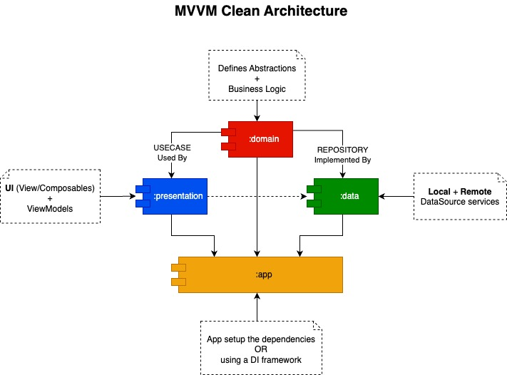
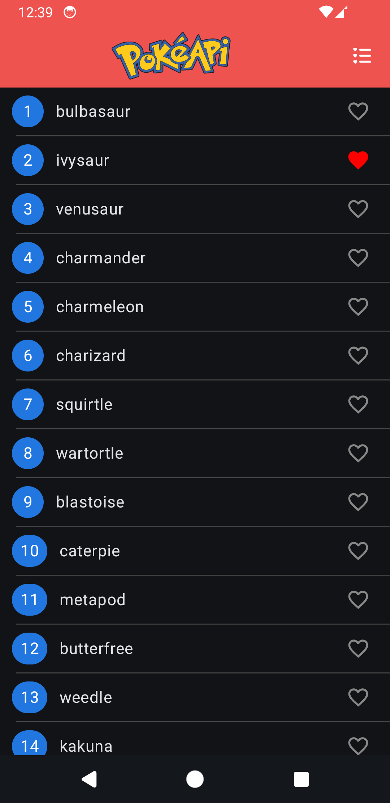
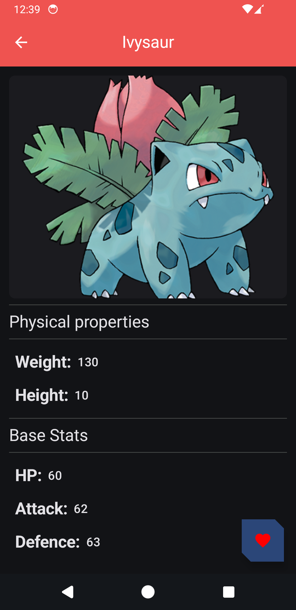
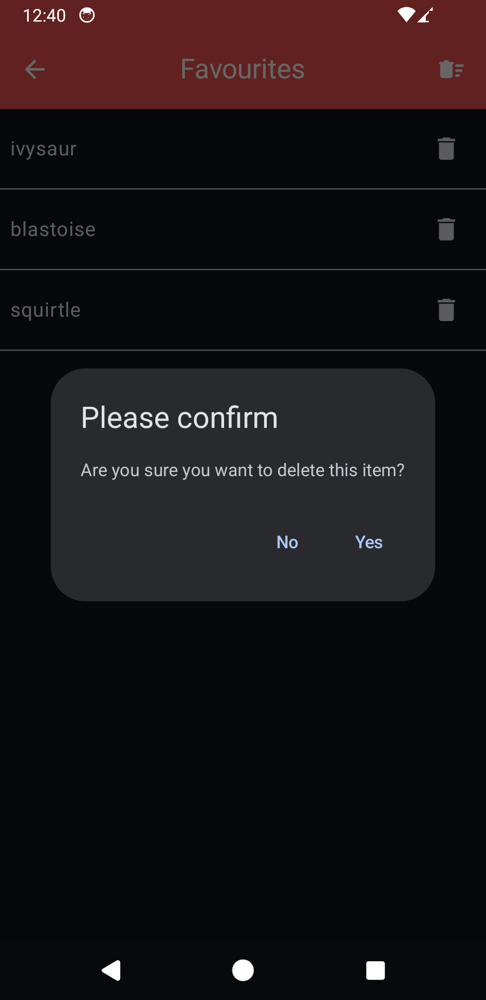

# Pokédex App

A modern Android app to explore Pokémon using Jetpack Compose and MVVM Clean
Architecture. Browse a list of Pokémon, view detailed stats, and manage your favourites — all with a
clean, scalable,
modular codebase.

Data is powered from [PokéAPI](https://pokeapi.co/docs/v2) which provides RESTful Pokémon data.
It supports pagination and data is available is JSON format.

## 🚀 Features

- 🧾 **List Screen**: View paginated Pokémon list names with Fav button option
- 📊 **Detail Screen**: See large image, stats, types, weight, height, and other properties
- ⭐ **Favourites Screen**: Manage favourites Pokémon
- 🌙 **Dark Mode Support**: Handles light and dark themes

## 🏗️ Architecture

The Pokédex app follows Clean Architecture, which separates the code into layers to enforce clear
separation of concerns. This approach helps in maintaining scalability, testability, and decoupling
components.

The layers in the Clean Architecture are:

1. Presentation Layer: Displays data and handles user interaction.
2. Domain Layer: Contains business logic and use cases.
3. Data Layer: Manages data sources (network and local).

- 🌐 Flow of Data
    - User Interaction: Triggered from the UI (e.g., open List Screen).
    - ViewModel: Calls Use Case to fetch data. Use Case: Fetches data via the Repository.
    - Repository: Gets data from either remote or local data sources.
    - UI: Observes changes and updates the display.



## 🧰 Tech Stack & Libraries

| Layer                | Tools & Libraries                                     |
|----------------------|-------------------------------------------------------|
| UI                   | Jetpack Compose, Material 3, Navigation-Compose, Coil |
| ViewModel            | AndroidX Lifecycle, Hilt for DI                       |
| Domain               | Kotlin Coroutines, Clean Use Cases                    |
| Data                 | Retrofit, Room, OkHttp, Gson, Flow                    |
| Testing              | JUnit, MockK / Mockito, Compose UI Testing            |
| Dependency Injection | Hilt (Dagger)                                         |
| Architecture         | MVVM + Clean Architecture (3-layer separation)        |

## 📸 Screenshots

| List Screen                   | Detail Screen                     | Favourites Screen                         |
|-------------------------------|-----------------------------------|-------------------------------------------|
|  |  |  |

### Testing

Some classes have been tested but with time is possible cover more tests

## 🛠️ How to Run

```
git clone https://github.com/filippoengidashet/Pokdex-App.git
```

and Run the App on Android Studio.
